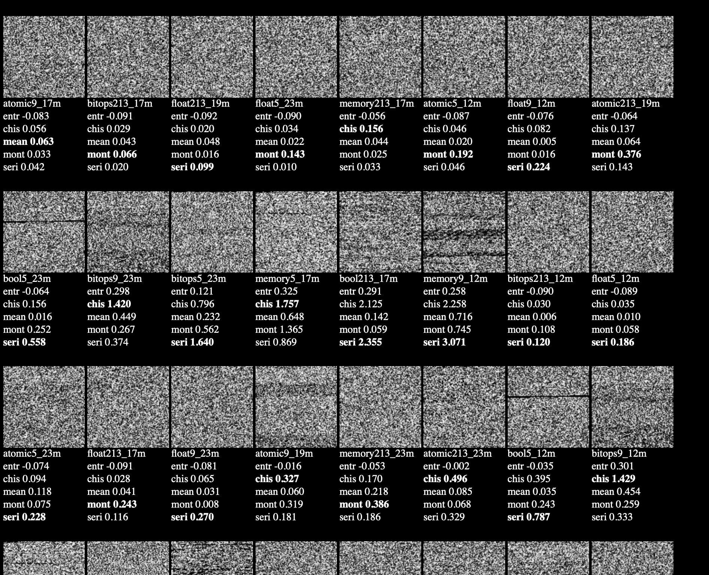

# SteveLib

SteveLib can generate random numbers, using time() instruction. (`rtdsc`?) 

Time() is interesting, its a physical sensor, like microphone, that can get physical entropy.

This is research to play around with! Don't expect anything more! Have fun experimenting or don't bother opening.

This project was inspired by the fatum project, a totally cool project about: Novelty, deeper mystery, and expanded exploration. Give it a look. http://randonauts.com    

# compile

	./make.sh
		(or)	
	./make.sh install

# Efforts made

* The design of the code is important. We need to "defeat optimisations". For example my time-generator doesn't just call `Time32`, it ALSO xor's the result and returns it, ensuring it isn't optimised away.
* We use warmups to help timings.
* We try various mod sizes to extract randomness. (like `temporal_rand() mod 17`)
* Uses histograms, von-neuman and XOR.
* We use some defines to make code more consistant. `Time_`, `for_`, `Gen`
* A lot more design is going on, inside... to make it work and be nice...

# theory

The aim is to see if we can get a computer to "Feel" things, or even just feel itself.

We need to step outside determinism. We need the computer to physically interact with itself. And sense emotions/energy. You might say "well physically sensing something doesn't give you that". But actually all physical objects even rocks or metal can sense emotions or energy, or nothing can.

Some physical objects are better at sensing emotions/energy, just like some physical objects are better for building a house out of, but no one is stopping you from building a cardboard house! And to be able to sense emotions AT ALL is better than nothing.

Thats the goal anyhow.

