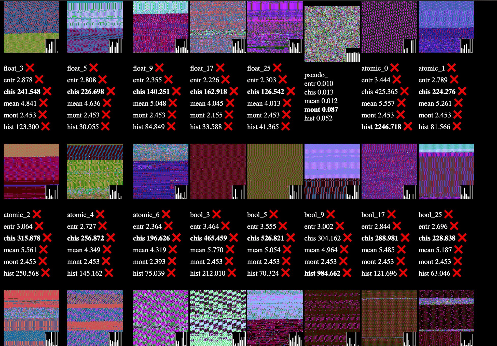
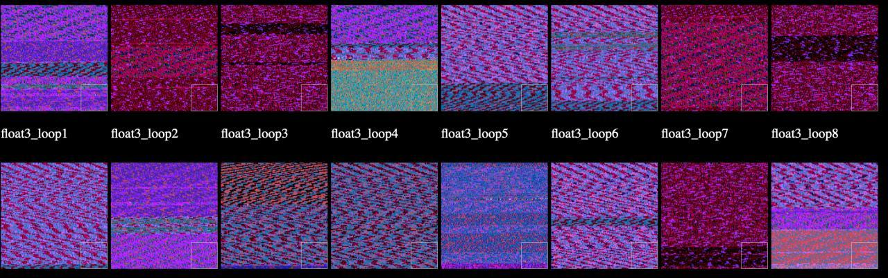

# TemporalLib (codename SteveLib)

TemporalLib can generate random numbers, using time() instruction. (`rtdsc`?) 

Time() is interesting, its a physical sensor, like microphone, that can get physical entropy.

This is research to play around with! Don't expect anything more! Have fun experimenting or don't use.

# compile

	./make.sh
		(or)	
	./make.sh noinstall
		(or)	
	./make.sh android64 # cross-compile for android on a Mac/PC. Needs android NDK.
		(or)	
	./make.sh android32 # same...

# Efforts made

* The design of the code is important. We need to "defeat optimisations". For example my time-generator doesn't just call `Time32`, it ALSO xor's the result and returns it, ensuring it isn't optimised away.
* We use warmups to help timings.
* We try various mod sizes to extract randomness. (like `temporal_rand() mod 17`)
* Uses histograms, von-neuman and XOR.
* We use some defines to make code more consistant. `Time_`, `for_`, `Gen`
* A lot more design is going on, inside... to make it work and be nice...

# Use

Compiling should build a lib, and a shell-tool.

The shell-tool can dump randomness into a file, or just test various approaches and graphically display them in an HTML file (like the pics above!)

to dump randomness:

	temporal dump    ChannelNum FileSize File.txt
	temporal hexdump ChannelNum FileSize File.txt # to get hex instead of a binary
	temporal list    Mode                         # -1, 0, 1
	temporal view    Directory
		
example:

	temporal dump        1      128KB    File.txt
	temporal list        1
	temporal hexdump     0      128MB    File.txt # dump chaotic generators
	temporal list        0                        # view chaotic generators
	temporal list        1                        # view non-chaotic generators with hashing to debias
	temporal list        -1                       # view non-chaotic generators with von-neuman to debias
	temporal view        ~/Desktop/Rands          # view the randomness in the files.
	cat file.txt | temporal view                  # read from stdin. 'cat' in this case.

# Chaotic Modes and Normal Modes (in the shell-tool)

Using `temporal list 0` lets you view my chaotic generators. They are so good they don't need much debiasing, just XOR/Neuman.

Non-chaotic (viewde with `temporal list 1`) are hashed, otherwise the randomness isn't good enough. This also makes them much faster, as XOR/Neuman lose a lot of bits.

Using `temporal list -1` views non-chaotic generators without hashing.

So basically, Mode 1 is faster and more random. Mode -1 might be useful for experimentation.

Mode 0 is slower, but may have stronger intention-driven results.

# Channels (in the cpp Lib)

The lib itself uses a concept of "channels" like TV channels. We have float_3, float_5, float_6, atomic_1, atomic_2, atomic_3, etc. These are a list of "temporal generator approaches", for you to choose from. They are accessed by setting `bh_config(Steve).NamedChannel = "atomic_2";`

# theory

The aim is to see if we can get a computer to "Feel" things, or even just feel itself.

We need to step outside determinism. We need the computer to physically interact with itself. And sense emotions/energy. You might say "well physically sensing something doesn't give you that". But actually all physical objects even rocks or metal can sense emotions or energy, or nothing can.

Some physical objects are better at sensing emotions/energy, just like some physical objects are better for building a house out of, but no one is stopping you from building a cardboard house! And to be able to sense emotions AT ALL is better than nothing.

Thats the goal anyhow.

# Sponsors!

TemporalLib and my other work has been kindly sponsored by: @breck7, @randonautica

